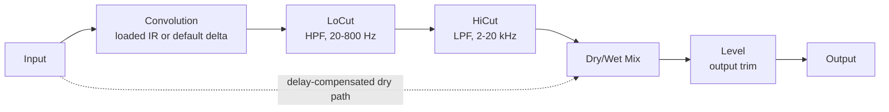

# Architecture

## Signal flow

Everything from the convolution through HiCut is the "wet" path, owned by `CabConvolutionEngine` (`src/dsp/CabConvolutionEngine.{h,cpp}`). The dry path is the untouched input signal, delayed to stay time-aligned with the wet path (see [Latency and the convolution engine](#latency-and-the-convolution-engine) below), then blended in at the Mix stage via `juce::dsp::DryWetMixer`. Level is applied last, after the mix, as a straightforward output trim.

## Module map

| Directory | Responsibility |
|---|---|
| `src/dsp` | All audio-thread DSP: `CabConvolutionEngine` (convolution, LoCut/HiCut filters, dry/wet mix, output level). No allocation, locks, or file I/O once `prepare()` has run. Independent of `juce::AudioProcessor` so it is directly unit-testable (see `tests/EngineTests.cpp`). |
| `src/params` | Parameter layout and `AudioProcessorValueTreeState` definitions - parameter IDs, ranges, defaults. Single source of truth for what a preset captures (aside from the IR file path, which is not an APVTS parameter - see [IR file loading and state](#ir-file-loading-and-state)). |
| `src/PluginProcessor.*` | Host plumbing: APVTS construction, `prepareToPlay`/`processBlock`/`reset`, latency reporting, state save/load, and IR file I/O (`loadImpulseResponseFromFile`/`loadDefaultImpulseResponse`). Reads APVTS values and pushes them into `CabConvolutionEngine` every block; does not implement any DSP itself. |
| `src/PluginEditor.*` | A simple, functional v0.1 GUI: one rotary slider per parameter bound via `SliderAttachment`, plus "Load IR..."/"Default" buttons and a label showing the currently loaded IR's file name. A custom vector-drawn GUI is a later milestone. |

Dependency direction is one-way: `PluginEditor` -> `params` (via attachments) and `PluginProcessor` -> `params` + `dsp`. `src/params` depends on `src/dsp` only for its `CabConvolutionEngine::loCutMinHz`/`loCutMaxHz`/`hiCutMinHz`/`hiCutMaxHz` range constants, so the parameter ranges and the engine's own bypass-threshold logic can never drift out of sync. `src/dsp` itself has no upward dependency on the processor, params, or UI, which is what keeps `CabConvolutionEngine` testable in isolation and free of any file-I/O concerns.

## Filter bypass at the range extremes

LoCut's default (its range minimum, 20 Hz) and HiCut's default (its range maximum, 20 kHz) are each an explicit "off" position: rather than merely computing an extreme-but-still-active filter cutoff, `CabConvolutionEngine::process()` skips that filter's IIR processing entirely whenever the smoothed frequency is within `bypassEpsilonHz` of its bypass extreme. This is a deliberate design choice, not an incidental optimisation - even a 2nd-order Butterworth filter with a cutoff many octaves outside a test tone's frequency still imposes a small, real phase shift (asymptotically proportional to the inverse of the frequency ratio), which is enough to defeat a strict sample-domain null test long before the ratio becomes impractically large for a plugin's real parameter range. Skipping the filter entirely at the extremes guarantees the plugin's default state - and any explicit "LoCut/HiCut wide open" setting - is a true, bit-accurate passthrough (down to floating-point precision), which is exactly what `tests/EngineTests.cpp`'s null tests verify.

When a filter transitions from bypassed to engaged, `CabConvolutionEngine::process()` resets that filter's IIR state first, so it always starts from a clean, predictable state rather than reusing whatever memory it was left in an arbitrary number of blocks ago. This is a deliberate simplification: it produces a normal filter turn-on transient (the same kind any IIR filter has starting from silence) rather than attempting to avoid it, which would require cross-fading between bypassed and engaged paths.

## Latency and the convolution engine

`CabConvolutionEngine` constructs `juce::dsp::Convolution` with its default configuration (`Latency{0}`), which selects the zero-latency uniformly partitioned convolution algorithm - the shortest-latency option JUCE offers, at the cost of higher CPU use than the fixed-latency or non-uniform alternatives (both of which trade some added, fixed delay for lower CPU). This is the right trade-off for a cabinet IR loader: cab IRs used for reamping are short (typically well under a second, often just a few hundred milliseconds), and reamping workflows are latency-sensitive (the plugin sits directly in a tracking chain), so keeping latency at zero is worth the CPU cost. `CabConvolutionEngine::getLatencySamples()` returns `juce::dsp::Convolution::getLatency()` directly, and `NaveAudioProcessor::prepareToPlay()` reports it to the host via `setLatencySamples()`, so host-side plugin delay compensation (PDC) accounts for the whole chain - though in practice this is always zero for this engine's configuration.

The dry path used by the Mix control still needs to stay time-aligned with the wet path in general (in case a future milestone ever changes the convolution configuration), so `CabConvolutionEngine` uses `juce::dsp::DryWetMixer` rather than a hand-rolled delay line: the pre-processing signal is captured via `pushDrySamples()` before the convolution or filters touch the buffer, and `setWetLatency(getLatencySamples())` configures the mixer's internal delay line to match (currently always 0). `mixWetSamples()` then blends the two back together, so at Mix = 100% the output is (once the filters are bypassed, per above) a sample-accurate passthrough of the input - the exact scenario `tests/EngineTests.cpp`'s null tests verify, to well under -80 dBFS residual.

One JUCE 8.0.14 behaviour worth calling out because it cost real debugging time in a sibling plugin (see `tests/DryWetMixerContractTests.cpp` in `tight-boost`, a same-author sibling of this plugin, for the full regression coverage): `DryWetMixer`'s internal dry/wet gain smoothers default their *target* to fully wet (`mix == 1.0`) until `setWetMixProportion()` is called, and the mixer's own `reset()` (invoked from its `prepare()`) only snaps the smoothers' *current* value to whatever *target* is set at that moment - it has no idea what the "real" starting Mix parameter value should be. `CabConvolutionEngine::prepare()` works around this by calling `dryWetMixer.setWetMixProportion(lastMixProportion)` *before* its own `reset()` runs, so the mixer is already sitting at the correct dry/wet balance from the very first `process()` call, regardless of what Mix was set to.

## Asynchronous IR loading

`juce::dsp::Convolution::loadImpulseResponse()` is documented as wait-free (the call itself never blocks or allocates on the calling thread), but the actual work of building the new convolution engine from the loaded IR happens **asynchronously**, on a background thread owned by the `Convolution`'s internal `ConvolutionMessageQueue`. Immediately after `loadImpulseResponse()` returns, `process()` may still be running the *previous* IR for some number of blocks - this is by design, and lets a live IR swap mid-playback cross-fade smoothly rather than glitching.

The one point at which a newly loaded IR is *guaranteed* to be synchronously installed is the next call to `Convolution::prepare()`: internally, `prepare()` first drains (and synchronously executes) any pending load command before rebuilding the active engine from whatever IR is now current. `CabConvolutionEngine` relies on this in two places: `prepare()` itself always loads before preparing (per the class's own documented contract), and any test or caller that needs a freshly loaded IR to be active *before the very next `process()` call* (rather than fading in over a live session) must call `prepare()` again after `setImpulseResponse()`/`loadDefaultImpulseResponse()` - see `tests/EngineTests.cpp`'s convolution-change test. In normal plugin use this doesn't matter: a user loading a new IR via the editor while the host is playing gets the intended smooth, glitch-free cross-fade instead.

## Convolution engine retention across `prepare()`

`juce::dsp::Convolution` internally retains the most recently loaded impulse response (and its original sample rate) across calls to `prepare()`, automatically re-resampling it against whatever new `ProcessSpec::sampleRate` is supplied. `CabConvolutionEngine::prepare()` relies on this: it only calls `loadDefaultImpulseResponse()` the first time it is ever prepared (tracked via `anyImpulseResponseLoaded`), not on every re-prepare (sample-rate change, etc.) - a previously loaded user IR survives a sample-rate change without needing to be manually reloaded.

## IR file loading and state

The currently loaded IR file's absolute path is **not** an `AudioProcessorValueTreeState` parameter - a file path has no meaningful float representation, and APVTS parameters are designed for continuously automatable values. Instead, `NaveAudioProcessor::loadImpulseResponseFromFile()` stores it directly as a plain property (`ParamIDs::irFilePathProperty`) on the live `apvts.state` `ValueTree`. Because `AudioProcessorValueTreeState::copyState()`/`replaceState()` preserve arbitrary tree properties (not just the parameter child nodes they manage), this path round-trips through the normal `getStateInformation()`/`setStateInformation()` flow without any extra serialisation code.

`loadImpulseResponseFromFile()` performs blocking file I/O (via `juce::AudioFormatManager`/`AudioFormatReader`) and must only be called off the audio thread - from the editor's `juce::FileChooser` callback (message thread) or from `setStateInformation()` (a session/preset-load operation, which JUCE guarantees is never called from the audio thread). The resulting `juce::AudioBuffer<float>` is then moved into `CabConvolutionEngine::setImpulseResponse()`, which forwards it to `juce::dsp::Convolution::loadImpulseResponse()` - a call documented by JUCE as wait-free, so it is safe regardless of which thread ultimately invokes it, even though this plugin only ever calls it from the message thread.

`setStateInformation()` reads the restored `irFilePathProperty` after `apvts.replaceState()` and, if it points at a file that still exists, calls `loadImpulseResponseFromFile()` again to bring the convolution engine's loaded IR back in sync with the restored state. If the stored path is empty, or points at a file that no longer exists, the engine falls back to the default delta IR via `loadDefaultImpulseResponse()` (which also clears the stored path in the latter case) rather than silently keeping whatever IR happened to be loaded beforehand.

## Parameter smoothing

- **LoCut** and **HiCut** are filter cutoff frequencies. Recomputing IIR coefficients involves trig calls, so these are not cheap to interpolate per sample; instead, each is smoothed with a `juce::SmoothedValue<float, ValueSmoothingTypes::Multiplicative>` (multiplicative smoothing suits frequencies, which are perceived logarithmically) and the filter coefficients (when not bypassed) are recomputed once per block from the smoothed value - a standard real-time-safe compromise.
- **Level** is a plain gain stage (`juce::dsp::Gain<float>`), which ramps sample-accurately via its own internal `SmoothedValue` (`setRampDurationSeconds`).
- **Mix** is smoothed both by the engine's own `juce::SmoothedValue<float, ValueSmoothingTypes::Linear>` (feeding `DryWetMixer::setWetMixProportion()` once per block) and by `DryWetMixer`'s own internal ~50 ms ramp on top of that.
- All smoothers are seeded to their real starting value in `CabConvolutionEngine::prepare()` (see `lastLoCutHz`/`lastHiCutHz`/`lastMixProportion`), so re-preparing (sample-rate change, etc.) never resets a live parameter back to a built-in default or lets a smoother ramp from an invalid 0 Hz/0.0 starting point.

## Real-time safety

- `NaveAudioProcessor::processBlock()` starts with `juce::ScopedNoDenormals`.
- All DSP state (the convolution engine, filters, the dry/wet delay line) is allocated in `prepare()`/`prepareToPlay()` and never reallocated on the audio thread.
- `reset()` clears all filter/convolution/delay-line state without deallocating (`CabConvolutionEngine::reset()`, called from both `AudioProcessor::reset()` and internally from `prepare()`).
- Parameter values are read via `apvts.getRawParameterValue()` atomics in `processBlock()`, never via `apvts.getParameter()->getValue()` (which is not guaranteed lock/allocation-free) and never via `String`-keyed lookups on the audio thread.
- `CabConvolutionEngine::process()` treats a zero-sample block as a safe no-op before touching any filter/convolution state.
- IR file loading (`loadImpulseResponseFromFile`) is only ever invoked from the message thread (editor) or from `setStateInformation()` (session/preset load) - never from `processBlock()`. The actual `juce::dsp::Convolution::loadImpulseResponse()` call it makes is documented as wait-free regardless.
- Filter cutoff frequencies passed to `IIR::Coefficients::makeHighPass`/`makeLowPass` are clamped below Nyquist (`clampBelowNyquist`, in `CabConvolutionEngine.cpp`) as defensive insurance against invalid coefficients if the plugin is ever prepared at an unusually low sample rate.
